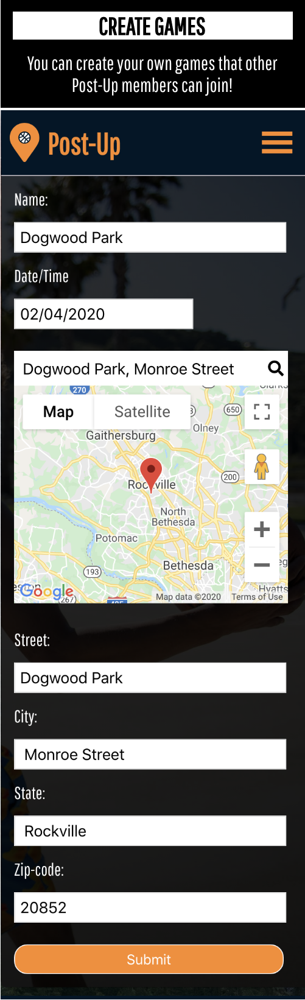

# Post-Up App

### Demo: https://iamcharliekim-post-up-app.now.sh/

Post-Up App allows you to create, organize and find pickup basketball games in your area.  Each game has a roster-list of players who will be attending and also a commentboard to allow players to communicate and discuss anything they want before the game.

  - Users can create their own games by specifying a date, time, and place to play
  - Users can search for available games and 'Check-In' to confirm their attendance
  - Each game page also has a commentboard to allow users to communicate with each other 

# Screenshots

#### Home Screen:

#### Create Games:

#### Talk Trash:

# How To Use

1. Once you sign-up for an account, use your username and password to sign-in 
2. Once you sign-in, a list of games will be populated on the home screen
3. To see more details, click on the game-card 
4. If you plan on attending, click "Check-In"
5. You can "Check-Out" at anytime if plans change
6. Navigate to the game via Google Maps by clicking on the address-link
7. Communicate with others using the commentboard on the game page 
8. Create your own game by clicking '+ Create' in the navbar
9. Fill in all fields on the form and click 'Submit' to make your listing active
10. Click 'My Games' in the navbar to see a list of games you have created 

### Tech
* HTML
* CSS
* Javascript
* React 

# Post-Up Api

### Demo: https://iamcharliekim-post-up-app.now.sh/

This API services the Post-Up App.  All endpoints are protected and require a JWT.

# Base-URL
https://sleepy-fjord-75293.herokuapp.com/api

# Auth Endpoints
#### /auth/login

# Users Endpoints
#### /user/:user_id:
#### /users
#### /user

# Games Endpoints
#### /games
#### /games/:game_id
#### /games/attendance
#### /games/attendance/:game_id
#### /games/attendance/rsvp/:game_id
#### /games/mygames
#### /games/comments

### Tech
* NodeJS
* Express
* Knex
* Morgan
* Cors
* Helmet

### For Testing
* Mocha
* Chai
* Supertest

